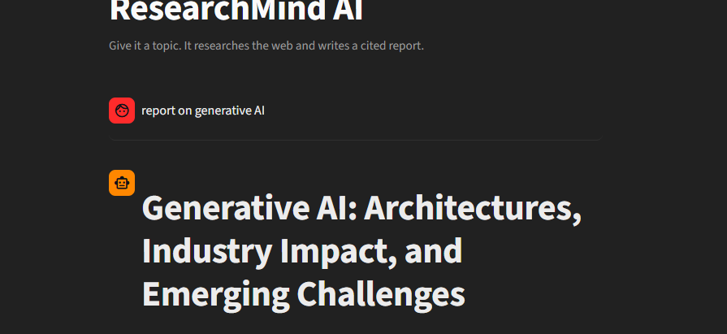
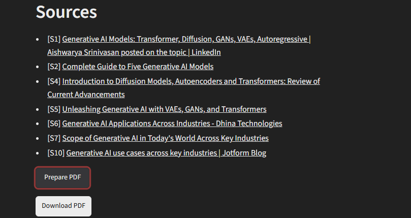

<div align="center">

# ResearchMind AI

### Agentic AI Research Assistant for Web + Document Intelligence

ResearchMind AI autonomously plans research, searches the web, analyzes uploaded PDFs, verifies information, and produces structured reports with inline citations.

[Live Demo](https://researchmind-aibyjawad.streamlit.app/) · [Report an Issue](https://github.com/jawad-hua/researchmind-ai/issues)

<br>


</div>

## Application Preview

### Research Workflow



### Sources & PDF Export



## Overview

ResearchMind AI is an agentic research system designed to automate multi-step research workflows.

Instead of sending a single prompt to an LLM, the system breaks a research request into smaller tasks, searches multiple sources, retrieves relevant information from uploaded documents, synthesizes findings, performs a fact-checking pass, and produces a cited final report.

It combines:

- Web research
- PDF/document intelligence
- Retrieval-Augmented Generation (RAG)
- Agentic planning
- Fact checking
- Citation generation
- Streaming responses
- PDF report export

The frontend and backend are separated, allowing the research engine to be reused by other clients such as mobile apps, command-line tools, or custom dashboards.

---

## Live Demo

Try the application here:

**[Open ResearchMind AI](https://researchmind-aibyjawad.streamlit.app/)**

> The hosted frontend communicates with the ResearchMind AI backend to execute the research pipeline.

---

## How It Works

```

User Research Request
        |
        v
+-----------------------+
|   Streamlit Frontend  |
+-----------------------+
        |
        | HTTP / SSE
        v
+-----------------------+
|    FastAPI Backend    |
+-----------------------+
        |
        v
+-----------------------+
|        Planner        |
| Breaks query into     |
| research tasks        |
+-----------------------+
        |
        +--------------------+
        |                    |
        v                    v
+----------------+   +----------------------+
|   Web Search   |   | Document Retrieval   |
|    Tavily      |   | ChromaDB + PDF Data  |
+----------------+   +----------------------+
        |                    |
        +---------+----------+
                  |
                  v
        +-------------------+
        |    Synthesizer    |
        | Groq-powered LLM  |
        +-------------------+
                  |
                  v
        +-------------------+
        |   Fact Checker    |
        +-------------------+
                  |
                  v
        +-------------------+
        | Cited Research    |
        | Report + PDF      |
        +-------------------+
---
```
## Overview

ResearchMind AI is an agentic research system designed to automate multi-step research workflows.

Instead of sending a single prompt to an LLM, the system breaks a research request into smaller tasks, searches multiple sources, retrieves relevant information from uploaded documents, synthesizes findings, performs a fact-checking pass, and produces a cited final report.

It combines:

- Web research
- PDF/document intelligence
- Retrieval-Augmented Generation (RAG)
- Agentic planning
- Fact checking
- Citation generation
- Streaming responses
- PDF report export

The frontend and backend are separated, allowing the research engine to be reused by other clients such as mobile apps, command-line tools, or custom dashboards.

---

## Live Demo

Try the application here:

**[Open ResearchMind AI](https://researchmind-aibyjawad.streamlit.app/)**

> The hosted frontend communicates with the ResearchMind AI backend to execute the research pipeline.

---

## How It Works

```text
User Research Request
        |
        v
+-----------------------+
|   Streamlit Frontend  |
+-----------------------+
        |
        | HTTP / SSE
        v
+-----------------------+
|    FastAPI Backend    |
+-----------------------+
        |
        v
+-----------------------+
|        Planner        |
| Breaks query into     |
| research tasks        |
+-----------------------+
        |
        +--------------------+
        |                    |
        v                    v
+----------------+   +----------------------+
|   Web Search   |   | Document Retrieval   |
|    Tavily      |   | ChromaDB + PDF Data  |
+----------------+   +----------------------+
        |                    |
        +---------+----------+
                  |
                  v
        +-------------------+
        |    Synthesizer    |
        | Groq-powered LLM  |
        +-------------------+
                  |
                  v
        +-------------------+
        |   Fact Checker    |
        +-------------------+
                  |
                  v
        +-------------------+
        | Cited Research    |
        | Report + PDF      |
        +-------------------+

```

---

## Core Features

### Agentic Research

ResearchMind AI decomposes complex questions into smaller research tasks instead of relying on a single search request.

### Web Research

Uses Tavily Search API to retrieve relevant information from the live web.

### Document Research

Users can upload PDF documents and include their contents as research sources.

### Retrieval-Augmented Generation

Uploaded documents are processed and indexed using ChromaDB so relevant information can be retrieved during research.

### Source Citations

Research results contain inline citations and a structured source list.

### Fact-Checking Layer

A dedicated fact-checking stage reviews generated claims and citation consistency before the final report is returned.

### Streaming Responses

Research reports can be streamed from the FastAPI backend using Server-Sent Events.

### PDF Export

Completed research reports can be exported as formatted PDF documents.

### REST API

The research engine is exposed through a documented FastAPI REST API.

### Automated Testing

The project contains automated tests for:

- Agent pipeline
- Backend endpoints
- Document processing
- PDF export
- Retrieval logic
- Research workflows

Tests run automatically through GitHub Actions.

### Docker Support

Backend and frontend can run as separate containers using Docker Compose.

---

## Tech Stack

| Category | Technologies |
|---|---|
| Language | Python |
| Backend | FastAPI, Uvicorn |
| Frontend | Streamlit |
| LLM | Groq |
| Web Search | Tavily Search API |
| Vector Database | ChromaDB |
| Document Processing | PyPDF / PDF processing utilities |
| Architecture | Agentic AI, RAG |
| API | REST, Server-Sent Events |
| Testing | Pytest |
| Deployment | Docker, Docker Compose |
| CI | GitHub Actions |
| Report Export | PDF generation |

---

## Project Structure

```text
researchmind-ai/
│
├── agent/
│   ├── document_loader.py
│   ├── extractor.py
│   ├── fact_checker.py
│   ├── planner.py
│   ├── search.py
│   ├── synthesizer.py
│   └── vector_store.py
│
├── backend/
│   ├── __init__.py
│   └── main.py
│
├── utils/
│   ├── llm_client.py
│   └── pdf_export.py
│
├── tests/
│   ├── conftest.py
│   ├── test_backend_api.py
│   ├── test_document_loader.py
│   ├── test_extractor.py
│   └── test_pdf_export.py
│
├── .github/
│   └── workflows/
│
├── .devcontainer/
├── assets/
├── app.py
├── docker-compose.yml
├── Dockerfile.backend
├── Dockerfile.frontend
├── requirements.txt
├── requirements-backend.txt
├── requirements-frontend.txt
├── requirements-dev.txt
├── pyproject.toml
├── pytest.ini
└── README.md
```

---

## Getting Started

### 1. Clone the repository

```bash
git clone https://github.com/jawad-hua/researchmind-ai.git
cd researchmind-ai
```

### 2. Create a virtual environment

#### Windows

```bash
python -m venv venv
venv\Scripts\activate
```

#### Linux / macOS

```bash
python3 -m venv venv
source venv/bin/activate
```

### 3. Install dependencies

```bash
pip install -r requirements.txt
```

For development and testing:

```bash
pip install -r requirements-dev.txt
```

---

## Environment Variables

Copy the example environment file:

```bash
cp .env.example .env
```

On Windows:

```bash
copy .env.example .env
```

Add your API keys:

```env
GROQ_API_KEY=your_groq_api_key
TAVILY_API_KEY=your_tavily_api_key
```

API keys can be obtained from:

- Groq Console
- Tavily

Never commit your real `.env` file or API keys to GitHub.

---

## Run Locally

ResearchMind AI uses separate backend and frontend services.

### Terminal 1 — Backend

```bash
uvicorn backend.main:app --reload --port 8000
```

Backend:

```text
http://localhost:8000
```

Interactive API documentation:

```text
http://localhost:8000/docs
```

### Terminal 2 — Frontend

```bash
streamlit run app.py
```

Frontend:

```text
http://localhost:8501
```

---

## Run With Docker

Create your `.env` file first and add the required API keys.

Then run:

```bash
docker compose up --build
```

This starts the frontend and backend as separate services.

To stop the containers:

```bash
docker compose down
```

---

## API Overview

### Create Research Session

```http
POST /sessions
```

Creates a new research session and returns a unique session ID.

### Upload Documents

```http
POST /sessions/{session_id}/documents
```

Uploads and indexes PDF documents for the current research session.

### List Documents

```http
GET /sessions/{session_id}/documents
```

Returns documents currently indexed in the session.

### Delete Document

```http
DELETE /sessions/{session_id}/documents/{source_key}
```

Removes an indexed document.

### Run Research

```http
POST /sessions/{session_id}/research
```

Runs the complete research pipeline and returns a cited report.

### Stream Research

```http
POST /sessions/{session_id}/research/stream
```

Streams research progress and generated report content using Server-Sent Events.

Possible event types include:

```text
status
token
done
error
```

### Health Check

```http
GET /health
```

Returns service health and configuration status.

---

## Testing

Run the complete test suite:

```bash
pytest -v
```

The test environment mocks external services such as:

- LLM calls
- Web search
- Embedding operations

This allows most tests to run without consuming external API credits.

Tests are also executed automatically through GitHub Actions.

---

## Example Research Workflow

### Input

```text
Explain the latest developments in Generative AI and create a structured report.
```

### ResearchMind AI Pipeline

```text
Question
   ↓
Research Planning
   ↓
Sub-question Generation
   ↓
Web Search + Document Retrieval
   ↓
Evidence Collection
   ↓
Report Synthesis
   ↓
Citation Processing
   ↓
Fact Checking
   ↓
Final Structured Report
```

### Output

The generated report can contain:

- Structured sections
- Research findings
- Inline source citations
- Source references
- Fact-check results
- PDF export

---

## Design Principles

ResearchMind AI is built around several engineering principles:

**Separation of Concerns**  
The frontend handles presentation while research logic remains inside the backend.

**Modular Agent Architecture**  
Planning, searching, retrieval, synthesis, and verification are implemented as separate components.

**API-First Design**  
The research engine can be consumed by interfaces other than Streamlit.

**Testability**  
External AI and search services can be mocked during automated tests.

**Deployment Portability**  
Docker support allows the system to run consistently across development and deployment environments.

---

## Roadmap

Future improvements include:

- Persistent vector storage
- Improved semantic chunking
- Research session history
- Conversation memory
- Multi-document knowledge bases
- Improved source ranking
- Advanced citation verification
- Structured logging
- Centralized configuration
- Background job processing
- Improved deployment scalability

---

## Security

Sensitive API credentials are loaded through environment variables.

The repository includes an `.env.example` file for configuration guidance.

Do not commit:

```text
.env
API keys
access tokens
private credentials
```

---

## Author

**Muhammad Jawad**

AI/ML Engineer focused on:

- Agentic AI
- LLM applications
- Retrieval-Augmented Generation
- Python
- FastAPI
- Machine Learning
- AI automation

[LinkedIn](https://www.linkedin.com/in/muhammad-jawad-ai/) ·
[Kaggle](https://www.kaggle.com/mjawadjawad) ·
[GitHub](https://github.com/jawad-hua)

---

## License

This project is licensed under the **MIT License**.

---

<div align="center">

### ResearchMind AI

Building practical agentic AI systems for real-world research workflows.

</div>

